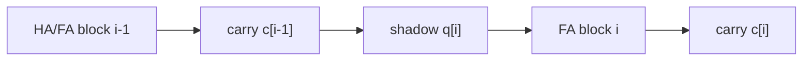
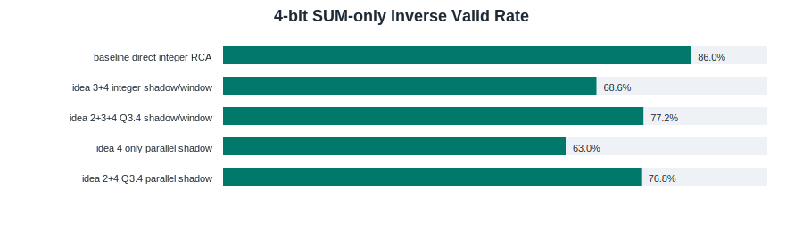
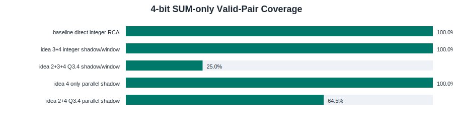
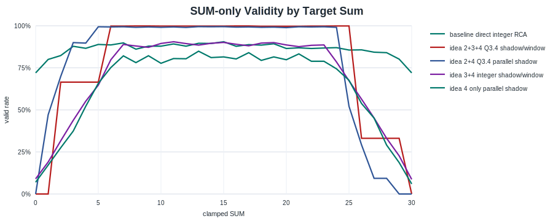

# Presentation RCA Experiments: Timing Windows, Shadow Carries, and Q3.4 Weights

Date: 2026-05-25

## 1. Problem Encountered

The ripple-carry adder is combinational in Boolean logic, but its stochastic invertible implementation behaves as a pseudo-time-dependent system. The least significant stage must collapse first, its carry must then be transferred, and only afterward can the next full-adder stage be interpreted reliably. When all HA/FA blocks are activated simultaneously, a downstream FA can settle under an incorrect carry-in and subsequently become difficult to correct.

This explains why simply increasing the intrablock Hamiltonian gap is not sufficient. A larger local gap increases a block's confidence in the boundary value currently presented to it. For a downstream FA with state x and incoming carry c, its local distribution is proportional to exp(-beta H_FA(x; c)). If c is initially wrong, a large beta*Delta_intra suppresses later correction. The interblock copy must therefore be strong enough to transmit the carry, but not so dominant that adjacent blocks freeze simultaneously.

## 2. Ideas Tested

Idea 1: equalize gate energy gaps. This was positive for small combinational logic, but it does not solve adders by itself because RCA failure is dominated by carry timing rather than only by unequal local gate gaps.

Idea 2: Q3.4 / Q8-style larger dynamic-range weights. The optimized HA/FA blocks increase the internal valid-invalid gap, but the tests show that FP/Q scaling alone is not reliable across ripple blocks. In this experimental suite it is therefore evaluated both as an individual negative control and as part of the combined idea 2+3+4 configuration.

Idea 3: sequential annealing windows. Blocks are activated in carry order, so each later block receives a more reliable upstream carry.

Idea 4: one shadow carry node. Between block i-1 and block i, c[i-1] is briefly copied into q[i]. The downstream FA reads q[i] as its carry-in, but q[i] is not updated by that FA. This creates a directional latch-like bias without requiring a full clocked digital register.



## 3. Primitive Gate Visualizations

These figures provide the gate-level reference for every primitive block used here: AND, OR, NAND, NOR, HA/XOR, XNOR, and FA. The first figure shows all state energies with valid Boolean states in green. The second shows reverse-clamped input distributions; invalid reverse choices are red.


## 4. ModelSim Protocol

All 4-bit tests are exhaustive over A,B in 0..15. Each case is solved 100 times from randomized trajectories. The generated VHDL uses OS-random seed salts, and every trial starts with an unclamped scramble window before the solve window. The constrained inverse test clamps B and SUM and measures whether A is recovered.

The 8-bit results are intentionally non-exhaustive companion checks. They use six selected vectors and 100 repeated solves per vector.

## 5. 4-bit Exhaustive Results


For the main comparison, all shadow/window rows use the conservative 40-cycle-per-block schedule. Shorter Q3.4 schedules are evaluated separately in the forward-only window reduction check below.

| Session | Direction | Cases | Trials/case | Total success | Min hits | Non-perfect cases |
|---|---:|---:|---:|---:|---:|---:|
| baseline direct RCA | forward A+B->SUM | 256 | 100 | 85.69% (21937/25600) | 41 | 256 |
| idea 3+4 integer shadow RCA | forward A+B->SUM | 256 | 100 | 85.94% (22001/25600) | 67 | 256 |
| idea 3+4 integer shadow RCA | inverse B+SUM->A | 256 | 100 | 89.01% (22787/25600) | 81 | 256 |
| idea 2 only Q3.4 direct RCA | forward A+B->SUM | 256 | 100 | 70.53% (18056/25600) | 0 | 162 |
| idea 3 only sequential window RCA | forward A+B->SUM | 256 | 100 | 46.79% (11977/25600) | 17 | 256 |
| idea 3 only sequential window RCA | inverse B+SUM->A | 256 | 100 | 54.79% (14027/25600) | 27 | 256 |
| idea 4 only parallel shadow RCA | forward A+B->SUM | 256 | 100 | 65.36% (16732/25600) | 39 | 256 |
| idea 4 only parallel shadow RCA | inverse B+SUM->A | 256 | 100 | 74.46% (19061/25600) | 54 | 256 |
| idea 2+3+4 Q3.4 shadow RCA | forward A+B->SUM | 256 | 100 | 99.65% (25511/25600) | 97 | 77 |
| idea 2+3+4 Q3.4 shadow RCA | inverse B+SUM->A | 256 | 100 | 99.67% (25516/25600) | 98 | 76 |

Forward heatmaps:


Backward constrained inverse heatmaps:


### Forward Window Reduction Check

Motivation: the main comparison above uses the conservative `40,40,40,40` schedule so that the forward and constrained inverse rows share the same hyperparameter setting. A separate forward-only study was then used to estimate how far the carry-window schedule can be shortened while remaining above the direct-RCA baseline.

Experiment: forward-only exhaustive tests were run over all 256 A/B vectors with 100 randomized trajectories per vector, keeping the same Q3.4 HA/FA weights, shadow carry topology, copy weight, and noise settings. A primitive AND sanity check showed that a literal one-cycle clamp/readout can be misleading, because the unclamped output can still reflect the previous input state on that clock edge. The corrected protocol therefore primes clamped inputs for one clock before the solve window and samples after a post-edge readout delay.

| Idea 2+3+4 forward schedule | Solve cycles | Total success | Min hits | Non-perfect cases |
|---|---:|---:|---:|---:|
| 40,40,40,40, copy=2 | 166 | 99.65% (25511/25600) | 97 | 77 |
| 10,8,16,6, copy=2 | 46 | 98.78% (25287/25600) | 89 | 153 |
| 2,2,4,2, copy=2 | 16 | 96.30% (24654/25600) | 79 | 184 |

Result: the shortest physically justified forward setting tested here is `2,2,4,2` with `copy=2`. It uses 16 solve cycles and reaches 96.30%, which is 10.61 percentage points above the direct integer baseline of 85.69%. The earlier `1,1,1,1` setting is excluded because it was not supported by the gate-level sanity check. These shortened schedules are not used for the main constrained inverse comparison; they are reported only as a forward completion-time study.

## 6. Individual Idea Ablation

The ablation tests isolate the mechanisms that are combined in the final configuration.

| Session | Direction | Cases | Trials/case | Total success | Min hits | Non-perfect cases |
|---|---:|---:|---:|---:|---:|---:|
| baseline direct RCA | forward A+B->SUM | 256 | 100 | 85.69% (21937/25600) | 41 | 256 |
| idea 3+4 integer shadow RCA | forward A+B->SUM | 256 | 100 | 85.94% (22001/25600) | 67 | 256 |
| idea 3+4 integer shadow RCA | inverse B+SUM->A | 256 | 100 | 89.01% (22787/25600) | 81 | 256 |
| idea 2 only Q3.4 direct RCA | forward A+B->SUM | 256 | 100 | 70.53% (18056/25600) | 0 | 162 |
| idea 3 only sequential window RCA | forward A+B->SUM | 256 | 100 | 46.79% (11977/25600) | 17 | 256 |
| idea 3 only sequential window RCA | inverse B+SUM->A | 256 | 100 | 54.79% (14027/25600) | 27 | 256 |
| idea 4 only parallel shadow RCA | forward A+B->SUM | 256 | 100 | 65.36% (16732/25600) | 39 | 256 |
| idea 4 only parallel shadow RCA | inverse B+SUM->A | 256 | 100 | 74.46% (19061/25600) | 54 | 256 |
| idea 2+3+4 Q3.4 shadow RCA | forward A+B->SUM | 256 | 100 | 99.65% (25511/25600) | 97 | 77 |
| idea 2+3+4 Q3.4 shadow RCA | inverse B+SUM->A | 256 | 100 | 99.67% (25516/25600) | 98 | 76 |

Individual forward heatmaps:


The idea 2 only test is the clearest negative control. It changes the local HA/FA energy scale, but leaves the RCA timing graph unchanged. Numerically, direct integer forward success is 85.69%, while idea 2 alone is 70.53%; the combined idea 2+3+4 run reaches 99.65% under the 40-cycle main protocol.

Mathematically, the node update uses

```text
P(m_i = +1 | field F_i) = (1 + tanh(F_i)) / 2.
```

Scaling Q3.4 weights increases |F_i| and therefore saturates tanh. This is beneficial when the local boundary values are already correct. It is harmful when a downstream FA sees a premature or wrong carry, because the wrong local minimum becomes harder to escape. In low-temperature form, a correction requiring an energy increase Delta has probability proportional to exp(-beta Delta); idea 2 increases Delta without fixing carry arrival time. Idea 3 changes time, idea 4 changes the carry boundary topology, and the combined 2+3+4 case is where the larger local gap becomes useful.

In this run, idea 3 alone reaches 46.79% forward and idea 4 alone reaches 65.36% forward. Idea 3+4 without Q3.4 reaches 85.94% forward, showing that timing and topology provide limited benefit by themselves. The high-confidence Q3.4 blocks become substantially beneficial only when combined with that timing isolation.

## 7. Clamp SUM-Only Inverse Test

This test is reported separately because it is not the same inverse task as `B+SUM->A`. Here only the five SUM bits are clamped, while both A and B are free. For each target SUM in 0..30, the solver should sample valid `(A,B)` pairs whose sum matches the clamp. A strong result needs three things at once: high valid rate, broad coverage of all valid pairs, and a distribution that is not collapsed onto only a few pairs.

The earlier main table did not include this because it measures distribution quality, not only recovery of one missing operand. That distinction is important for an invertible logic discussion: a deterministic inverse can look good under `B+SUM->A`, while a SUM-only clamp reveals whether the machine is actually sampling the full valid manifold.

All SUM-only runs below are 4-bit exhaustive over SUM=0..30 with 1000 independent randomized trajectories per SUM, so each row uses 31,000 total solves.







| Pattern | Valid rate | Valid-pair coverage | Entropy vs uniform | TV from uniform | Zero-valid sums |
|---|---:|---:|---:|---:|---:|
| baseline direct integer RCA | 85.95% (26645/31000) | 100.00% (256/256) | 0.974 | 0.125 | 0 |
| idea 3+4 integer shadow/window | 68.60% (21267/31000) | 100.00% (256/256) | 0.987 | 0.092 | 0 |
| idea 2+3+4 Q3.4 shadow/window | 77.25% (23946/31000) | 25.00% (64/256) | 0.317 | 0.752 | 3 |
| idea 2+3+4 Q3.4 reverse-order shadow/window | 76.70% (23776/31000) | 75.78% (194/256) | 0.726 | 0.428 | 0 |
| idea 4 only parallel shadow | 62.95% (19516/31000) | 100.00% (256/256) | 0.984 | 0.101 | 0 |
| idea 2+4 Q3.4 parallel shadow | 76.83% (23818/31000) | 64.45% (165/256) | 0.658 | 0.507 | 3 |

The direct integer baseline is useful here because it separates SUM-only inverse behavior from the shadow/window ideas. The result is mixed. The integer direct and shadow variants preserve the valid-pair manifold well: every valid `(A,B)` pair appears, and the entropy among valid samples stays close to uniform. However, the shadow variants still produce too many invalid `(A,B)` samples when only SUM is clamped.

The forward-order Q3.4 SUM-only runs improve validity relative to shadow-only cases, but they collapse the distribution. The original idea 2+3+4 SUM-only run sees only 64 of 256 valid pairs and has three target sums with zero valid samples. Reversing the block order for SUM-only and keeping `40,40,40,40` windows fixes part of that: coverage rises to 194/256 and zero-valid sums drop to zero. It still does not beat the direct baseline in valid rate, and the edge sums remain weak: `SUM=0` is 8.8% valid and `SUM=30` is 20.0% valid.

Thus, the present energy distribution is tuned for forward and constrained inverse recovery, but not yet for SUM-only inverse sampling. Future work should tune the energy distribution to balance validity against entropy on the clamped manifold. Such tuning is more likely to be practical with floating-point or fixed-point continuous weights than with integer weights, because the objective is not merely to increase the local gate gap; it is to shape relative energies among many globally valid states while keeping invalid states suppressed.

## 8. 8-bit Non-exhaustive Companion


| Session | A | B | Expected SUM | Hits | Distinct sums |
|---|---:|---:|---:|---:|---:|
| baseline direct RCA | 37 | 219 | 256 | 0/100 (0.0%) | 12 |
| baseline direct RCA | 142 | 73 | 215 | 67/100 (67.0%) | 14 |
| baseline direct RCA | 201 | 54 | 255 | 23/100 (23.0%) | 20 |
| baseline direct RCA | 91 | 188 | 279 | 71/100 (71.0%) | 12 |
| baseline direct RCA | 6 | 177 | 183 | 38/100 (38.0%) | 22 |
| baseline direct RCA | 127 | 1 | 128 | 61/100 (61.0%) | 16 |
| idea 2 only Q3.4 direct RCA | 37 | 219 | 256 | 0/100 (0.0%) | 2 |
| idea 2 only Q3.4 direct RCA | 142 | 73 | 215 | 100/100 (100.0%) | 1 |
| idea 2 only Q3.4 direct RCA | 201 | 54 | 255 | 100/100 (100.0%) | 1 |
| idea 2 only Q3.4 direct RCA | 91 | 188 | 279 | 0/100 (0.0%) | 2 |
| idea 2 only Q3.4 direct RCA | 6 | 177 | 183 | 100/100 (100.0%) | 1 |
| idea 2 only Q3.4 direct RCA | 127 | 1 | 128 | 0/100 (0.0%) | 3 |
| idea 3+4 integer shadow RCA | 37 | 219 | 256 | 70/100 (70.0%) | 16 |
| idea 3+4 integer shadow RCA | 142 | 73 | 215 | 73/100 (73.0%) | 18 |
| idea 3+4 integer shadow RCA | 201 | 54 | 255 | 63/100 (63.0%) | 21 |
| idea 3+4 integer shadow RCA | 91 | 188 | 279 | 82/100 (82.0%) | 11 |
| idea 3+4 integer shadow RCA | 6 | 177 | 183 | 67/100 (67.0%) | 18 |
| idea 3+4 integer shadow RCA | 127 | 1 | 128 | 66/100 (66.0%) | 21 |
| idea 2+3+4 Q3.4 shadow RCA | 37 | 219 | 256 | 100/100 (100.0%) | 1 |
| idea 2+3+4 Q3.4 shadow RCA | 142 | 73 | 215 | 98/100 (98.0%) | 2 |
| idea 2+3+4 Q3.4 shadow RCA | 201 | 54 | 255 | 100/100 (100.0%) | 1 |
| idea 2+3+4 Q3.4 shadow RCA | 91 | 188 | 279 | 100/100 (100.0%) | 1 |
| idea 2+3+4 Q3.4 shadow RCA | 6 | 177 | 183 | 100/100 (100.0%) | 1 |
| idea 2+3+4 Q3.4 shadow RCA | 127 | 1 | 128 | 98/100 (98.0%) | 3 |

## 9. Interpretation

The important comparison is not only whether one frozen readout is correct, but the repeated-solve probability after independent randomization. The direct integer RCA is the baseline failure mode. Idea 3+4 tests whether timing windows plus one shadow node repair the carry direction. Idea 2+3+4 tests whether the same topology benefits from the Q3.4 optimized gate weights while preserving the moderate interblock copy.

In this dataset, integer idea 3+4 is only a modest improvement over the direct 8-bit baseline and is roughly tied with the 4-bit direct baseline under the repeated-solve metric. The combined idea 2+3+4 result is the strongest positive result: Q3.4 plus the shadow/window schedule reaches 99.65% forward and 99.67% constrained inverse success on exhaustive 4-bit tests under the 40-cycle main protocol, and about 99-100% on the selected 8-bit vectors. This suggests that the larger intrablock gap is helpful only after timing isolation is added.

## 10. Exact Parameters

Baseline direct RCA:

- 4-bit VHDL: `src/generated_presentation_direct_adder4.vhd`
- 8-bit VHDL: `src/generated_presentation_direct_adder8.vhd`
- 4-bit seed salt: `PRESENTATION_DIRECT4_2089CBEAE9BD7891`
- 8-bit seed salt: `PRESENTATION_DIRECT8_03AC0721525296FE`
- Noise weight: 1
- Scramble cycles: 80
- Settle cycles: 500
- Trials per A,B case: 100

Idea 2 only Q3.4 direct RCA:

- 4-bit VHDL: `src/generated_presentation_direct_q34_adder4.vhd`
- 8-bit VHDL: `src/generated_presentation_direct_q34_adder8.vhd`
- 4-bit seed salt: `PRESENTATION_Q34_DIRECT4_6AB312F3CB926BA4`
- 8-bit seed salt: `PRESENTATION_Q34_DIRECT8_5F13371CC61F068B`
- Q3.4 interpretation: physical value = encoded / 16
- Noise weight: encoded 4, physical 0.25
- Scramble cycles: 80
- Settle cycles: 500

Idea 3 only sequential window RCA:

- 4-bit VHDL: `src/generated_presentation_windowed_integer_adder4.vhd`
- 4-bit seed salt: `PRESENTATION_INT4_WINDOW_4C776B861F45C248`
- Window cycles: 40,40,40,40
- Solve noise: active_rnd=1; scramble noise=2

Idea 4 only parallel shadow RCA:

- 4-bit VHDL: `src/generated_presentation_shadow1_integer_adder4.vhd`
- Shadow topology: one q node between carry blocks
- Activation: all blocks and shadow-copy nodes hot together
- Settle cycles: 160
- Solve noise: block_rnd=1, copy_rnd=0; scramble noise=2

Idea 3+4 integer shadow RCA:

- 4-bit VHDL: `src/generated_presentation_shadow1_integer_adder4.vhd`
- 8-bit VHDL: `src/generated_presentation_shadow1_integer_adder8.vhd`
- 4-bit seed salt: `PRESENTATION_INT4_SHADOW1_37298A3607990CB4`
- 8-bit seed salt: `PRESENTATION_INT8_SHADOW1_4E898EE9DC6C6495`
- Copy weight: 4
- 4-bit window cycles: 40,40,40,40 with copy=2
- 8-bit window cycles: 40,40,40,40,40,40,40,40 with copy=2
- Solve noise: block_rnd=1, copy_rnd=0; scramble noise=2

Idea 2+3+4 Q3.4 shadow RCA:

- 4-bit VHDL: `src/generated_presentation_shadow1_q34_adder4.vhd`
- 8-bit VHDL: `src/generated_presentation_shadow1_q34_adder8.vhd`
- 4-bit seed salt: `PRESENTATION_Q34_4_SHADOW1_5ED6F27AF69F9C93`
- 8-bit seed salt: `PRESENTATION_Q34_8_SHADOW1_29FE5AD3BFF46B23`
- Q3.4 interpretation: physical value = encoded / 16
- Copy weight: encoded 64, physical 4.0
- 4-bit main forward/inverse window cycles: 40,40,40,40 with copy=2
- 4-bit forward-only reduction schedules: 10,8,16,6 with copy=2 reaches 98.78%; 2,2,4,2 with copy=2 reaches 96.30% under the corrected clamp-prime/readout protocol
- 8-bit window cycles: 40,40,40,40,40,40,40,40 with copy=2
- Solve noise: block_rnd=4 encoded = 0.25 physical, copy_rnd=0; scramble noise=8 encoded = 0.5 physical

Clamp SUM-only runs:

- Direct baseline testbench: `tb/tb_adder4_direct_sum_randomized_distribution.vhd`
- Direct baseline runner: `sim/run_adder4_direct_sum_randomized_distribution.ps1`
- Shadow/window testbench: `tb/tb_adder4_shadow1_sum_randomized_distribution.vhd`
- Shadow/window runner: `sim/run_adder4_shadow1_sum_randomized_distribution.ps1`
- Scope: SUM=0..30, 1000 independent randomized solves per SUM
- Baseline direct integer: adder_rnd=1, scramble=80, settle=500
- Idea 3+4 integer: block_rnd=1, copy_rnd=0, scramble_rnd=2, windows=40,40,40,40, copy=2
- Idea 2+3+4 Q3.4 forward-order SUM-only: block_rnd=4 encoded, copy_rnd=0, scramble_rnd=8 encoded, windows=10,8,16,6, copy=2
- Idea 2+3+4 Q3.4 reverse-order: block_rnd=4 encoded, copy_rnd=0, scramble_rnd=8 encoded, windows=40,40,40,40, copy=2
- Idea 4 only: block_rnd=1, copy_rnd=0, scramble_rnd=2, parallel settle=160
- Idea 2+4 Q3.4: block_rnd=4 encoded, copy_rnd=0, scramble_rnd=8 encoded, parallel settle=160

Integer HA h:

`[1, 1, -1, -2]`

Integer HA J:

| 0 | -1 | 1 | 2 |
| -1 | 0 | 1 | 2 |
| 1 | 1 | 0 | -2 |
| 2 | 2 | -2 | 0 |

Integer FA h:

`[0, 0, 0, 0, 0]`

Integer FA J:

| 0 | -1 | -1 | 1 | 2 |
| -1 | 0 | -1 | 1 | 2 |
| -1 | -1 | 0 | 1 | 2 |
| 1 | 1 | 1 | 0 | -2 |
| 2 | 2 | 2 | -2 | 0 |

Q3.4 HA h encoded:

`[56, 56, -56, -112]`

Q3.4 HA J encoded:

| 0 | -56 | 56 | 112 |
| -56 | 0 | 56 | 112 |
| 56 | 56 | 0 | -112 |
| 112 | 112 | -112 | 0 |

Q3.4 HA gap: encoded 112, physical 7.0000

Q3.4 FA h encoded:

`[0, 0, 0, 0, 0]`

Q3.4 FA J encoded:

| 0 | -56 | -56 | 56 | 112 |
| -56 | 0 | -56 | 56 | 112 |
| -56 | -56 | 0 | 56 | 112 |
| 56 | 56 | 56 | 0 | -112 |
| 112 | 112 | 112 | -112 | 0 |

Q3.4 FA gap: encoded 112, physical 7.0000

## 11. Artifacts

- Manifest: `data/manifest.json`
- Gate energy CSV: `data/gate_energy_landscape.csv`
- Gate reverse CSV: `data/gate_reverse_distributions.csv`
- 4-bit case CSV: `data/adder4_cases.csv`
- 4-bit summary CSV: `data/adder4_summary.csv`
- SUM-only aggregate CSV: `data/sum_only_aggregate.csv`
- SUM-only by-SUM CSV: `data/sum_only_by_sum.csv`
- SUM-only valid-pair CSV: `data/sum_only_valid_pairs.csv`
- Idea 2+3+4 forward window sweep CSV: `data/idea234_forward_window_sweep.csv`
- 8-bit repeated-solve CSV: `data/adder8_repeated.csv`
- Corrected Q3.4 40-cycle exhaustive transcript: `traces/idea234_q34_4.txt`
- Corrected Q3.4 shortened-schedule transcript: `traces/idea234_q34_4_w10_8_16_6_corrected.log`
- Other ModelSim transcripts: `traces/`
