# Presentation RCA Experiments: Timing Windows, Shadow Carries, and Q3.4 Weights

Date: 2026-05-25

## 1. Problem Encountered

The ripple-carry adder is combinational in Boolean logic, but in the stochastic invertible circuit it behaves like a pseudo-time-dependent system. Bit 0 has to collapse first, then its carry must be transferred before bit 1 can be trusted, and so on. If every HA/FA block is hot together, a later FA can settle using the wrong carry-in and then become hard to move.

This is why simply increasing the intrablock Hamiltonian gap is not automatically helpful. A larger local gap increases the block's confidence in whatever boundary value it currently sees. For a downstream FA with state x and incoming carry c, its local distribution is proportional to exp(-beta H_FA(x; c)). If c is wrong early, a high beta*Delta_intra suppresses later correction. The interblock copy must be strong enough to pass the carry, but not so dominant that it forces both sides to freeze at the same time.

## 2. Ideas Tested

Idea 1: equalize gate energy gaps. This was positive for small combinational logic, but it does not solve adders by itself because RCA failure is dominated by carry timing, not just unequal local gate gaps.

Idea 2: Q3.4 / Q8-style larger dynamic-range weights. The optimized HA/FA blocks increase the internal valid-invalid gap, but the earlier tests showed that FP/Q scaling alone is not reliable across ripple blocks. In this fresh suite it is tested only as part of idea 2+3+4.

Idea 3: sequential annealing windows. Blocks are activated in carry order, so each later block receives a more reliable upstream carry.

Idea 4: one shadow carry node. Between block i-1 and block i, c[i-1] is briefly copied into q[i]. The downstream FA reads q[i] as its carry-in, but q[i] is not updated by that FA. This creates a directional latch-like bias without requiring a full clocked digital register.

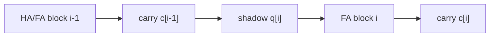

## 3. Primitive Gate Visualizations

These figures restore the gate-level view for every primitive block used here: AND, OR, NAND, NOR, HA/XOR, XNOR, and FA. The first figure shows all state energies with valid Boolean states in green. The second shows reverse-clamped input distributions; invalid reverse choices are red.

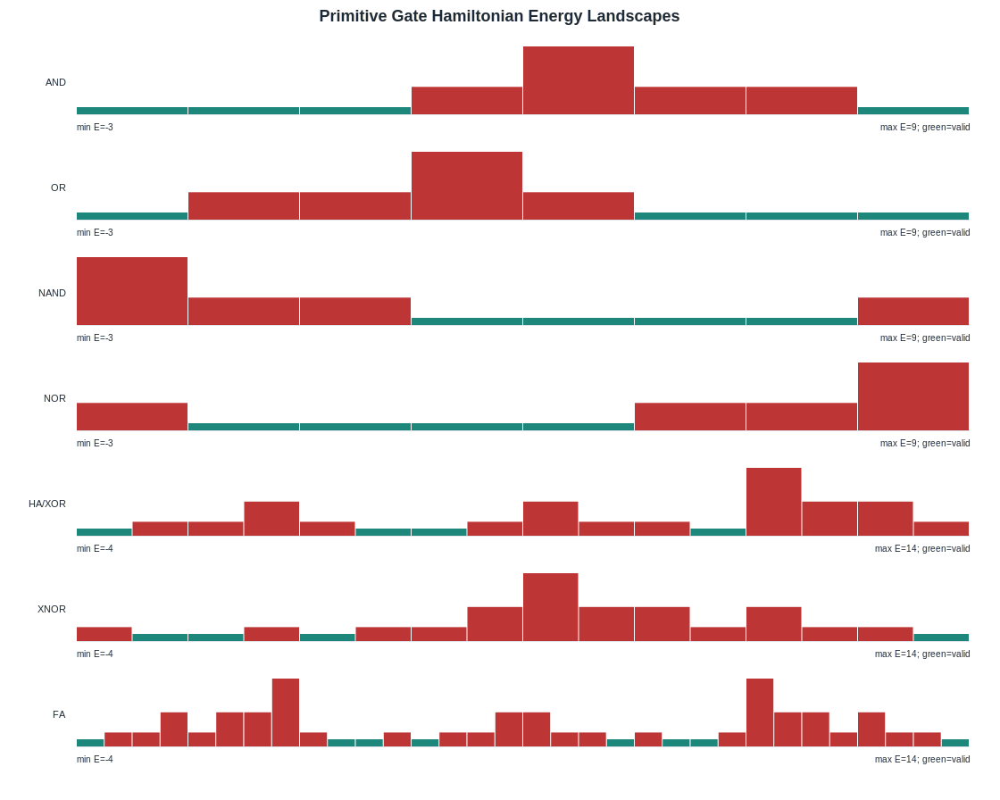

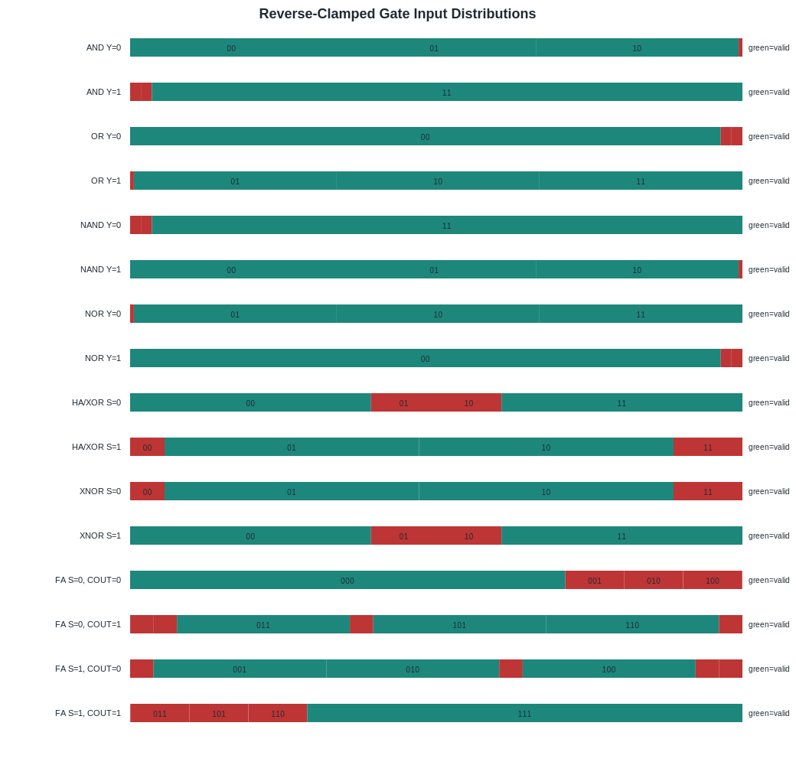

## 4. Fresh ModelSim Protocol

All 4-bit tests here are exhaustive over A,B in 0..15. Each case is solved 100 times from randomized trajectories. The generated VHDL uses OS-random seed salts, and every trial starts with an unclamped scramble window before the solve window. The constrained inverse test clamps B and SUM and measures whether A is recovered.

The 8-bit results are intentionally non-exhaustive companion checks, per the latest scope decision. They use six selected vectors and 100 repeated solves per vector.

## 5. 4-bit Exhaustive Results

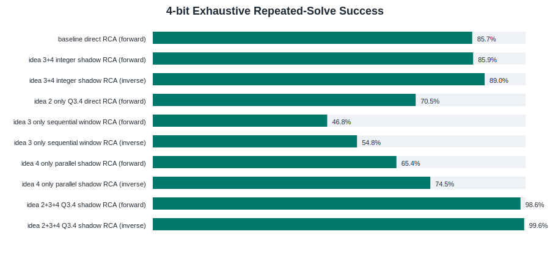

| Session | Direction | Cases | Trials/case | Total success | Min hits | Non-perfect cases |
|---|---:|---:|---:|---:|---:|---:|
| baseline direct RCA | forward A+B->SUM | 256 | 100 | 85.69% (21937/25600) | 41 | 256 |
| idea 3+4 integer shadow RCA | forward A+B->SUM | 256 | 100 | 85.94% (22001/25600) | 67 | 256 |
| idea 3+4 integer shadow RCA | inverse B+SUM->A | 256 | 100 | 89.01% (22787/25600) | 81 | 256 |
| idea 2 only Q3.4 direct RCA | forward A+B->SUM | 256 | 100 | 70.53% (18056/25600) | 0 | 162 |
| idea 3 only sequential window RCA | forward A+B->SUM | 256 | 100 | 46.79% (11977/25600) | 17 | 256 |
| idea 3 only sequential window RCA | inverse B+SUM->A | 256 | 100 | 54.79% (14027/25600) | 27 | 256 |
| idea 4 only parallel shadow RCA | forward A+B->SUM | 256 | 100 | 65.36% (16732/25600) | 39 | 256 |
| idea 4 only parallel shadow RCA | inverse B+SUM->A | 256 | 100 | 74.46% (19061/25600) | 54 | 256 |
| idea 2+3+4 Q3.4 shadow RCA | forward A+B->SUM | 256 | 100 | 98.64% (25251/25600) | 92 | 153 |
| idea 2+3+4 Q3.4 shadow RCA | inverse B+SUM->A | 256 | 100 | 99.62% (25502/25600) | 95 | 77 |

Forward heatmaps:

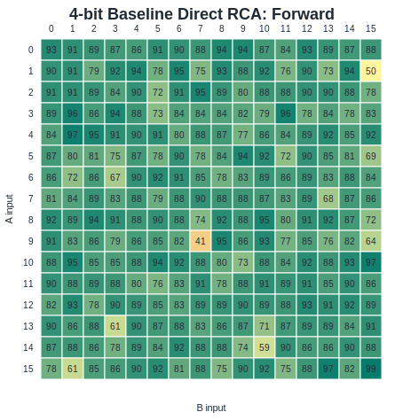

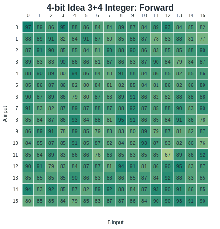

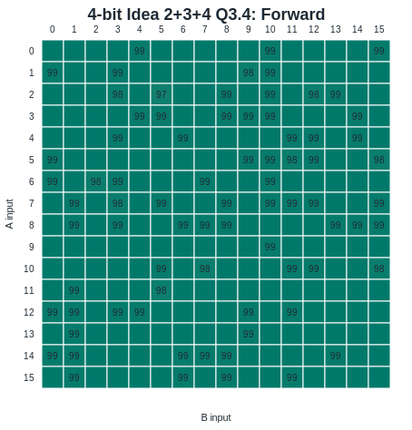

Backward constrained inverse heatmaps:

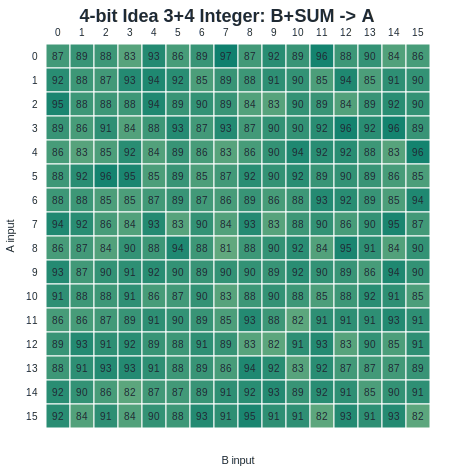

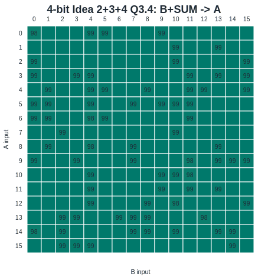

## 6. Individual Idea Ablation

The ablation tests isolate the ideas that were bundled in the successful run.

| Session | Direction | Cases | Trials/case | Total success | Min hits | Non-perfect cases |
|---|---:|---:|---:|---:|---:|---:|
| baseline direct RCA | forward A+B->SUM | 256 | 100 | 85.69% (21937/25600) | 41 | 256 |
| idea 3+4 integer shadow RCA | forward A+B->SUM | 256 | 100 | 85.94% (22001/25600) | 67 | 256 |
| idea 3+4 integer shadow RCA | inverse B+SUM->A | 256 | 100 | 89.01% (22787/25600) | 81 | 256 |
| idea 2 only Q3.4 direct RCA | forward A+B->SUM | 256 | 100 | 70.53% (18056/25600) | 0 | 162 |
| idea 3 only sequential window RCA | forward A+B->SUM | 256 | 100 | 46.79% (11977/25600) | 17 | 256 |
| idea 3 only sequential window RCA | inverse B+SUM->A | 256 | 100 | 54.79% (14027/25600) | 27 | 256 |
| idea 4 only parallel shadow RCA | forward A+B->SUM | 256 | 100 | 65.36% (16732/25600) | 39 | 256 |
| idea 4 only parallel shadow RCA | inverse B+SUM->A | 256 | 100 | 74.46% (19061/25600) | 54 | 256 |
| idea 2+3+4 Q3.4 shadow RCA | forward A+B->SUM | 256 | 100 | 98.64% (25251/25600) | 92 | 153 |
| idea 2+3+4 Q3.4 shadow RCA | inverse B+SUM->A | 256 | 100 | 99.62% (25502/25600) | 95 | 77 |

Individual forward heatmaps:

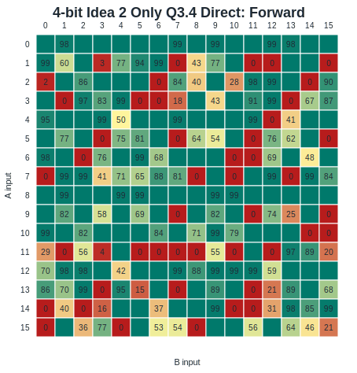

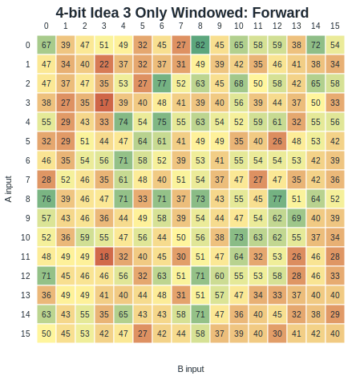

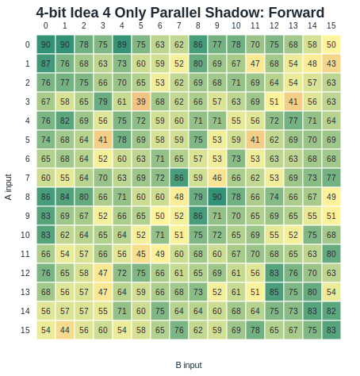

The idea 2 only test is the clearest negative control. It changes the local HA/FA energy scale, but leaves the RCA timing graph unchanged. Numerically, direct integer forward success is 85.69%, while idea 2 alone is 70.53%; the successful combined idea 2+3+4 run is 98.64%.

Mathematically, the node update uses

```text
P(m_i = +1 | field F_i) = (1 + tanh(F_i)) / 2.
```

Scaling Q3.4 weights increases |F_i| and therefore saturates tanh. That is good if the local boundary values are already correct. It is harmful when a downstream FA sees a premature or wrong carry, because the wrong local minimum becomes harder to escape. In low-temperature form, a correction requiring an energy increase Delta has probability proportional to exp(-beta Delta); idea 2 increases Delta without fixing carry arrival time. Idea 3 changes time, idea 4 changes the carry boundary topology, and the combined 2+3+4 case is where the larger local gap becomes useful.

In this run, idea 3 alone reaches 46.79% forward and idea 4 alone reaches 65.36% forward. Idea 3+4 without Q3.4 reaches 85.94% forward, showing that timing/topology help somewhat, but the high-confidence Q3.4 blocks only become strongly positive when used with that timing isolation.

## 7. 8-bit Non-exhaustive Companion

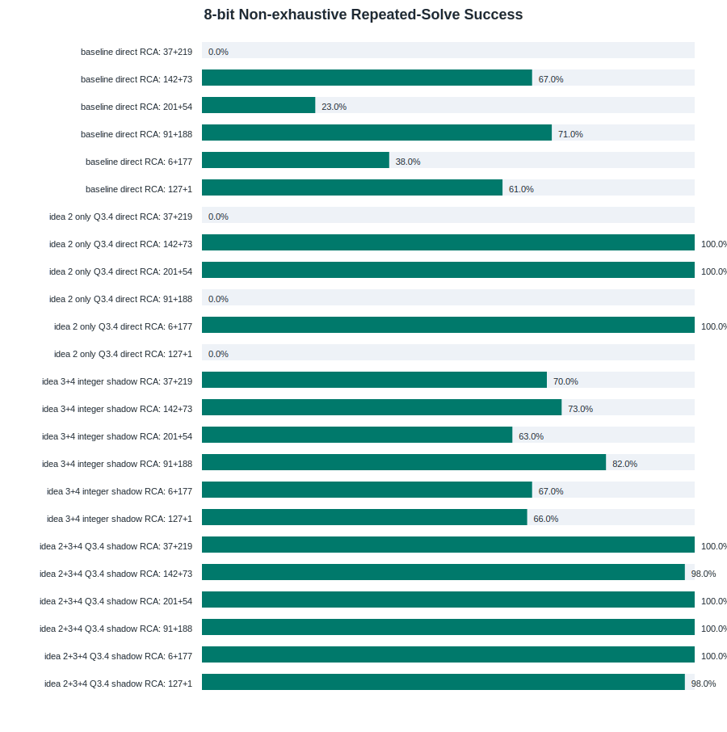

| Session | A | B | Expected SUM | Hits | Distinct sums |
|---|---:|---:|---:|---:|---:|
| baseline direct RCA | 37 | 219 | 256 | 0/100 (0.0%) | 12 |
| baseline direct RCA | 142 | 73 | 215 | 67/100 (67.0%) | 14 |
| baseline direct RCA | 201 | 54 | 255 | 23/100 (23.0%) | 20 |
| baseline direct RCA | 91 | 188 | 279 | 71/100 (71.0%) | 12 |
| baseline direct RCA | 6 | 177 | 183 | 38/100 (38.0%) | 22 |
| baseline direct RCA | 127 | 1 | 128 | 61/100 (61.0%) | 16 |
| idea 2 only Q3.4 direct RCA | 37 | 219 | 256 | 0/100 (0.0%) | 2 |
| idea 2 only Q3.4 direct RCA | 142 | 73 | 215 | 100/100 (100.0%) | 1 |
| idea 2 only Q3.4 direct RCA | 201 | 54 | 255 | 100/100 (100.0%) | 1 |
| idea 2 only Q3.4 direct RCA | 91 | 188 | 279 | 0/100 (0.0%) | 2 |
| idea 2 only Q3.4 direct RCA | 6 | 177 | 183 | 100/100 (100.0%) | 1 |
| idea 2 only Q3.4 direct RCA | 127 | 1 | 128 | 0/100 (0.0%) | 3 |
| idea 3+4 integer shadow RCA | 37 | 219 | 256 | 70/100 (70.0%) | 16 |
| idea 3+4 integer shadow RCA | 142 | 73 | 215 | 73/100 (73.0%) | 18 |
| idea 3+4 integer shadow RCA | 201 | 54 | 255 | 63/100 (63.0%) | 21 |
| idea 3+4 integer shadow RCA | 91 | 188 | 279 | 82/100 (82.0%) | 11 |
| idea 3+4 integer shadow RCA | 6 | 177 | 183 | 67/100 (67.0%) | 18 |
| idea 3+4 integer shadow RCA | 127 | 1 | 128 | 66/100 (66.0%) | 21 |
| idea 2+3+4 Q3.4 shadow RCA | 37 | 219 | 256 | 100/100 (100.0%) | 1 |
| idea 2+3+4 Q3.4 shadow RCA | 142 | 73 | 215 | 98/100 (98.0%) | 2 |
| idea 2+3+4 Q3.4 shadow RCA | 201 | 54 | 255 | 100/100 (100.0%) | 1 |
| idea 2+3+4 Q3.4 shadow RCA | 91 | 188 | 279 | 100/100 (100.0%) | 1 |
| idea 2+3+4 Q3.4 shadow RCA | 6 | 177 | 183 | 100/100 (100.0%) | 1 |
| idea 2+3+4 Q3.4 shadow RCA | 127 | 1 | 128 | 98/100 (98.0%) | 3 |

## 8. Interpretation

The important comparison is not only whether one frozen readout is correct, but the repeated-solve probability after fresh randomization. The direct integer RCA is the baseline failure mode. Idea 3+4 tests whether timing windows plus one shadow node repair the carry direction. Idea 2+3+4 tests whether the same topology benefits from the Q3.4 optimized gate weights while preserving the moderate interblock copy.

In this final dataset, integer idea 3+4 is only a modest improvement over the direct 8-bit baseline and is roughly tied with the 4-bit direct baseline under the repeated-solve metric. The combined idea 2+3+4 result is the clear positive result: Q3.4 plus the shadow/window schedule reaches 98.64% forward and 99.62% constrained inverse success on exhaustive 4-bit tests, and about 99-100% on the selected 8-bit vectors. This suggests the larger intrablock gap is helpful only after timing isolation is added.

## 9. Exact Parameters

Baseline direct RCA:

- 4-bit VHDL: `src/generated_presentation_direct_adder4.vhd`
- 8-bit VHDL: `src/generated_presentation_direct_adder8.vhd`
- 4-bit seed salt: `PRESENTATION_DIRECT4_2089CBEAE9BD7891`
- 8-bit seed salt: `PRESENTATION_DIRECT8_03AC0721525296FE`
- Noise weight: 1
- Scramble cycles: 80
- Settle cycles: 500
- Trials per A,B case: 100

Idea 2 only Q3.4 direct RCA:

- 4-bit VHDL: `src/generated_presentation_direct_q34_adder4.vhd`
- 8-bit VHDL: `src/generated_presentation_direct_q34_adder8.vhd`
- 4-bit seed salt: `PRESENTATION_Q34_DIRECT4_6AB312F3CB926BA4`
- 8-bit seed salt: `PRESENTATION_Q34_DIRECT8_5F13371CC61F068B`
- Q3.4 interpretation: physical value = encoded / 16
- Noise weight: encoded 4, physical 0.25
- Scramble cycles: 80
- Settle cycles: 500

Idea 3 only sequential window RCA:

- 4-bit VHDL: `src/generated_presentation_windowed_integer_adder4.vhd`
- 4-bit seed salt: `PRESENTATION_INT4_WINDOW_4C776B861F45C248`
- Window cycles: 40,40,40,40
- Solve noise: active_rnd=1; scramble noise=2

Idea 4 only parallel shadow RCA:

- 4-bit VHDL: `src/generated_presentation_shadow1_integer_adder4.vhd`
- Shadow topology: one q node between carry blocks
- Activation: all blocks and shadow-copy nodes hot together
- Settle cycles: 160
- Solve noise: block_rnd=1, copy_rnd=0; scramble noise=2

Idea 3+4 integer shadow RCA:

- 4-bit VHDL: `src/generated_presentation_shadow1_integer_adder4.vhd`
- 8-bit VHDL: `src/generated_presentation_shadow1_integer_adder8.vhd`
- 4-bit seed salt: `PRESENTATION_INT4_SHADOW1_37298A3607990CB4`
- 8-bit seed salt: `PRESENTATION_INT8_SHADOW1_4E898EE9DC6C6495`
- Copy weight: 4
- 4-bit window cycles: 40,40,40,40 with copy=2
- 8-bit window cycles: 40,40,40,40,40,40,40,40 with copy=2
- Solve noise: block_rnd=1, copy_rnd=0; scramble noise=2

Idea 2+3+4 Q3.4 shadow RCA:

- 4-bit VHDL: `src/generated_presentation_shadow1_q34_adder4.vhd`
- 8-bit VHDL: `src/generated_presentation_shadow1_q34_adder8.vhd`
- 4-bit seed salt: `PRESENTATION_Q34_4_SHADOW1_5ED6F27AF69F9C93`
- 8-bit seed salt: `PRESENTATION_Q34_8_SHADOW1_29FE5AD3BFF46B23`
- Q3.4 interpretation: physical value = encoded / 16
- Copy weight: encoded 64, physical 4.0
- 4-bit window cycles: 10,8,16,6 with copy=2
- 8-bit window cycles: 40,40,40,40,40,40,40,40 with copy=2
- Solve noise: block_rnd=4 encoded = 0.25 physical, copy_rnd=0; scramble noise=8 encoded = 0.5 physical

Integer HA h:

`[1, 1, -1, -2]`

Integer HA J:

| 0 | -1 | 1 | 2 |
| -1 | 0 | 1 | 2 |
| 1 | 1 | 0 | -2 |
| 2 | 2 | -2 | 0 |

Integer FA h:

`[0, 0, 0, 0, 0]`

Integer FA J:

| 0 | -1 | -1 | 1 | 2 |
| -1 | 0 | -1 | 1 | 2 |
| -1 | -1 | 0 | 1 | 2 |
| 1 | 1 | 1 | 0 | -2 |
| 2 | 2 | 2 | -2 | 0 |

Q3.4 HA h encoded:

`[56, 56, -56, -112]`

Q3.4 HA J encoded:

| 0 | -56 | 56 | 112 |
| -56 | 0 | 56 | 112 |
| 56 | 56 | 0 | -112 |
| 112 | 112 | -112 | 0 |

Q3.4 HA gap: encoded 112, physical 7.0000

Q3.4 FA h encoded:

`[0, 0, 0, 0, 0]`

Q3.4 FA J encoded:

| 0 | -56 | -56 | 56 | 112 |
| -56 | 0 | -56 | 56 | 112 |
| -56 | -56 | 0 | 56 | 112 |
| 56 | 56 | 56 | 0 | -112 |
| 112 | 112 | 112 | -112 | 0 |

Q3.4 FA gap: encoded 112, physical 7.0000

## 10. Artifacts

- Manifest: `data/manifest.json`
- Gate energy CSV: `data/gate_energy_landscape.csv`
- Gate reverse CSV: `data/gate_reverse_distributions.csv`
- 4-bit case CSV: `data/adder4_cases.csv`
- 4-bit summary CSV: `data/adder4_summary.csv`
- 8-bit repeated-solve CSV: `data/adder8_repeated.csv`
- ModelSim transcripts: `traces/`
